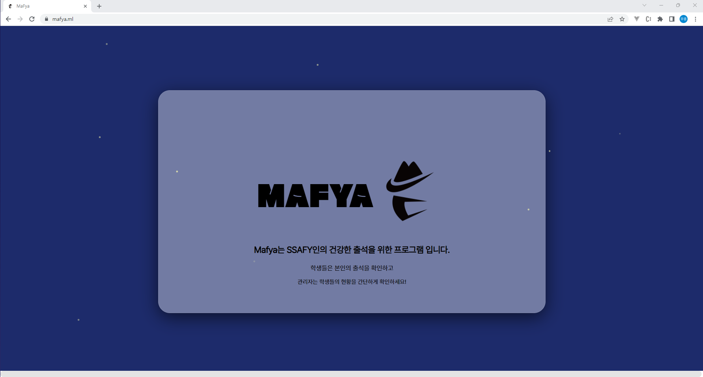

# MaFya

## Masked ssaFYcian Attendance System

## 배포

[MaFya](https://mafya.ml)

## ✨Overview

2020년도부터 시작된 코로나 바이러스로 인한 펜데믹 시대에 많은 사람들이 지치고 힘든 시간을 보내고 있습니다. 삼성 청년 SW 소프트웨어 아카데미에서도 코로나로 인해 비대면 수업과 대면 수업을 병행하고 있습니다. 현재 대면 수업 출석은 소속된 반에 있는 자기 자리에서 홈페이지 접속 후 출석 클릭을 통해 할 수 있습니다.

저희 MaFya 팀은 현행 출석 시스템을 보완하고자 MaFya 애플리케이션을 만들었습니다. MaFya는 object detection, 얼굴 인식, 마스크 인식과 같은 인공지능 기술을 통해서 학생들이 좀 더 빠르게 출석하는 것을 도와주고, 관리자와 학생 모두 편리하게 출결 현황을 확인할 수 있습니다.

## 🖼서비스 화면

### 로그인




### 관리자 페이지 - 메인 페이지


### 관리자 페이지 - 학생 등록 페이지


### 관리자 페이지 - 입실 화면


### 관리자 페이지 - 지각 화면


### 관리자 페이지 - 지각 누적 화면(결석)


### 관리자 페이지 - 조퇴 화면


### 관리자 페이지 - 퇴실 화면


### 학생 메인 페이지


## 👨‍👩‍👧 Notion

---

`A205 팀 노션 링크`

[https://www.notion.so/MaFya-a62ec8e0452f488fb4f031435261f113](https://www.notion.so/A205-f1a66e867a6f43adaff658bb0eb07425)

모두가 봐야할 공지, 참고 할 링크 등을 모아 관리했습니다. 팀 rule과 컨벤션 규칙을 정하고, flow chart와 ERD와 같은 개발에 필요한 자료들을 정리했습니다.

## ✨ 주요 기능

---

- 서비스 설명 : 삼성 청년SW아카데미 출석관리 웹 애플리케이션
- 주요 기능 :
  - tensorflow.js를 이용한 객체 탐지 사용
  - MT-CNN 모델 및 FaceNet을 통한 정확도 높은 얼굴 인식
  - 구글의 티쳐블 머신으로 학습한 모델을 통한 마스크 착용 여부 판단
  - MMS 기능을 통한 학생의 팀원 연락 혹은 관리자의 학생 관리
  - 상세 검색 기능을 통한 관리자의 편의성 증대

## 🖥️ 개발 환경

---

🖱**Backend**

- IntelliJ
- spring boot 2.7.3
- spring-boot-jpa
- Spring Security
- Java 8
- Mysql

🖱**Frontend**

- Visual Studio Code
- React.js 17.0.0
- React-dom 5.3.0
- react-webcam 5.2.0
- Material-UI
- sweetalett2 11.4.33
- tensorflow/tfjs 2.4.0
- tensorflow-models/coco-ssd 2.1.0

🖱 **Server**

- aws ec2
- docker
- nginx

🖱**CI/CD**

- Jenkins

## 🖥️ Flow Chart

---


- 오전 9시 이전
  - 얼굴 인식 후에 마스크 착용 음성 출력
  - 마스크를 정상적으로 착용했다면, 게이트 로그 요청을 보냄.
  - 그 응답이 입실이라면, 입실에 관련된 음성이 출력됨
  - 만약 중복된 입실 요청이라면, 중복에 관련된 음성이 출력됨
- 9시 이후
  - 얼굴 인식 후 게이트 로그 요청을 보냄
  - 만약 게이트 로그 응답이 지각이라면, 마스크 착용 음성 출력하고 마스크 착용 시에 지각 음성 출력
  - 게이트 로그 응답이 조퇴라면, 조퇴에 관련된 음성 출력
  - 게이트 로그 응답이 퇴실이라면, 퇴실에 관련된 음성이 출력
- 공통 사항
  - 학습되지 않은 사람이 접근 시에는 경고 음성 출력
  - 마스크 착용하지 않았을 경우에는 마스크 착용 음성 출력됨
- 게이트 로그 요청에 관한 응답값 정리
  ```bash
  - 0: 입실
  - 10: 지각
  - 11: 지각 한 후 조퇴
  - 12: 지각 한 후 정상 퇴실
  - 2: 정상 입실 후 조퇴
  - 3: 정상 퇴실
  - 4: 입실 후 다시 입실 요청(요청 안 받고, 지각 시간 이후부터 다시 체크 가능)
  - 99 : 입실 안함(결석)
  ```

## 💫 서비스 아키텍처

---


## ✨자동 배포와 SSL 인증서 적용

---

현재 자동 배포를 통해 [https://mafya.ml/](https://mafya.ml/) 도메인 에 백엔드, 프론트엔드를 모두 연결했고, AI 서버는 수동 배포를 통해 활성화되었습니다. AI 서버는 자동으로 배포할 경우 새로운 데이터를 학습하기 힘들기 때문에, 자동 배포를 하지 않았습니다.
또한 프론트엔드인 React.js와 백엔드인 Spring은 docker image로 만든 후 docker container를 통해 배포했습니다,. 그리고 Nginx와 letsencrypt를 이용하여 ssl 인증서를 적용했으며, 프론트엔드는 port 443(https)로 분기 했으며, 백엔드는 /api 경로로 프록시를 설정했습니다. 마지막으로 AI 서버는 /ai 경로로 통해 분기했습니다.

## ✨기술 특이점

---

- **객체 탐지**

  Object detection에는 tensorflow js를 사용했습니다. Tensorflow.js는 웹 프론트엔드에서 쉽게 머신 러닝을 활용할 수 있는 자바스크립트 라이브러리입니다. 보통 다른 인공지능 프로젝트에서는 프론트엔드는 끊임없이 백엔드에 사진을 전송하는 역할만 수행합니다. 하지만, 이러한 방법은 서버의 부하를 높인다는 단점이 있습니다. 그래서 저희 Mafya에서는 프론트엔드에서 object detcetion을 하여 서버에 전송되는 사진을 줄여 서버의 가용성을 높이는 한편, ssd 방식을 사용하여 이 과정에서 걸리는 시간을 줄여 어플리케이션 이용자의 불편함을 줄였습니다.

- **얼굴 인식**

얼굴 인식에는 MT-CNN 모델과 faceNet을 사용했습니다. MT-CNN은 이미지에서 얼굴 이미지를 바운딩 박스 처리하여, 이에 관한 행렬 데이터를 도출하며, 멀티 서치 기능과 바운딩 박스의 영역 크기에 구애 받지 않는다는 장점이 있어서 어플리케이션의 확장성을 고려하여 사용했습니다. 도출된 행렬 데이터를 아용하여 faceNet에서 사용할 수 있는 규격의 데이터로 만들어 전송합니다. faceNet은 추출된 바운딩 박스에서 얼굴 특징을 추출하여 학습된 이미지 중에서 가장 유사한 이미지를 반환합니다. 그 결과 특정 이용자를 학습된 모델을 통해 식별하고, 이를 바탕으로 출석 처리를 할 수 있습니다.

- **마스크 인식**

마스크 인식을 위해 구글의 티쳐블 머신을 사용했습니다. 티쳐블 머신은 인공지능에 관한 지식이 부족하더라도 쉽게 모델을 구현할 수 있는 학습 도구입니다. 구체적으로는 마스크 착용 여부에 관한 라벨을 나눠 각각의 해당하는 다량의 이미지를 학습시켜서 이에 관한 모델을 도출했습니다. 주어진 환경에서 90 % 이상의 정확도를 보여주고 있으며, 그 결과 마스크 착용 여부를 판단할 수 있습니다.

- **MMS 기능 제공**

관리자가 결석 위험군인 학생들을 쉽게 관리하고 학생이 자신이 소속된 팀 구성원과 쉽게 연락할 수 있도록 MMS 기능을 구현했습니다. 네이버 Simple & Easy Notification Service을 이용했습니다. 이 서비스는 한달에 50개의 문자를 무료로 전송할 수 있으며, 이를 초과할 경우에는 한 건 당 8원의 이용 요금이 부과됩니다.

- **상세 검색 기능 제공**

관리자가 학생들을 쉽게 관리할 수 있도록, 다양한 검색 필터를 제공했습니다. 자세한 내용은 다음과 같습니다. 또한 정렬 기능을 제공하여 관리자가 특정 학생의 정보를 확인할 수 있도록 했습니다.

```bash
1. "" or "전체" => 학생 정보 전체               <유저 정보 얻기>
2. "결석" or "지각" [반 이름, ... Default X] [팀코드, ... Default X] [날짜, Default 오늘]          <출석 정보 얻기>
3. [반 이름, ... Deafult X] [팀 코드, ... Deafult X] [날짜, ... or "전부" Default 오늘]      <유저 정보 얻기> <출석 정보 얻기(날짜, 전부)>
4. ["이름", ... Deafult X] [날짜, ... or "전부" Default 오늘]               <유저 정보 얻기> <출석 정보 얻기(날짜, 전부)>

* 단체 검색 포함 시 최소 검색 단위는 팀코드 개별 검색 단위는 따로
*막아야 할 듯 : "전체", A205 전부 -> 전체 정보나오고 A205 정보 또나옴 => 안 막음 ','로 인한 중복은 휴먼 에러
*상태 컬럼 추가: 상태 컬럼은 (정상/지각/결석) 3가지 원소 값
*추가기능 ','로 2개 이상의 content 입력

3반 a205 -> 유저 정보 얻기 [3]
3반 a205 전부 -> 출석(결석/지각) 정보 얻기 [3]
3반 A205 결석 -> 출석(결석) 정보 얻기 [2]
3반 A205 지각 -> 출석(지각) 정보 얻기 [2]
9/25 -> 출석 정보 얻기 [3]
박세현 -> 유저 정보 얻기 [4]
박세현 9/25 -> 출석 정보 얻기 [4]
박세현 전부 -> 출석 정보 얻기 [4]
```

- **배포**

  MaFya의 프론트엔드와 백엔드(스프링)은 Jenkins를 통해 자동으로 배포되었습니다. frontend 브랜치에 merge 이벤트나 push가 일어날 경우 프론트엔드가 자동으로 배포되고, backend 브랜치에 merge 이벤트나 push가 일어날 경우 백엔드가 자동으로 배포됩니다. AI 서버는 docker를 통해 이미지를 만든 후 수동으로 배포하여 관리하고 있습니다.

## 👨‍👩‍👧 협업 툴

---

- `Git`
- `Jira`
- `Notion`
- `Mattermost`
- `Webex`

---

---

## ✨코드 컨벤션

---

```
- 의미 없는 변수명 X, 최대한 직관적으로 변수명 지어주세요.
	⇒ 유지보수 힘들고, 알아보기 힘드니 반드시 지양해주세요.

- 메서드 이름은 소문자로 시작하고, 동사로 지으면 좋다! ex) getName()

- 변수명, 메서드 이름은 camelCase로 지어주세요

- 클래스 이름은 대문자로 시작합니다

- 리액트 컴포넌트명은 PascalCase로 지어주세요.
```

해당 [Code Convention 가이드](https://udacity.github.io/git-styleguide/), [네이밍 규칙](https://tyboss.tistory.com/entry/Java-%EC%9E%90%EB%B0%94-%EB%84%A4%EC%9D%B4%EB%B0%8D-%EA%B4%80%EC%8A%B5-java-naming-convention)를 참고하여 정했습니다.

## ✨Git 컨벤션

---

```
Feat:    새로운 기능을 추가할 경우
Fix:     버그를 고친 경우
Design:   코드 포맷 변경, 간단한 수정, 코드 변경이 없는 경우
Refacto: 프로덕션 코드 리팩토링
Docs:    문서를 수정한 경우(ex> Swagger)
Rename:  파일 혹은 폴더명 수정 및 이동
Remove:  파일 삭제

```

```
커밋 타입: 수정된 내역 설명
ex) FE: admin main page 로직 구성

```

해당 [Git 스타일 가이드](https://udacity.github.io/git-styleguide/)를 참고하여서 정했습니다

## 💡Git Flow 브랜치 전략

---

- Git Flow model을 사용
- 사용한 브랜치

  - feature - 백엔드/프론트엔드 각 기능
  - backend - 백엔드(Spring)
  - frontend - 프론트엔드
  - AI - 백엔드(AI)
  - develop - 개발
  - master - 배포

- Git Flow 진행 방식

  1. feature 브랜치에서 기능 개발이 완성되면 [backend or frontend] 브랜치로 pull request를 통해 merge한다.

     ⇒ pull request 시 이상이 없는지 확인하고 merge한다.

  2. backend, frontend 브랜치에서 서로 연결되는 작업 완성 시 develop 브랜치로 pull request를 통해 merge한다.
  3. 다음 배포 버전이 준비되면 master 브랜치로 pull request를 통해 merge한다.

- feature 브랜치 이름 명명 규칙
  - [fe or be]-[git 컨벤션] -[기능 이름]
    ex) fe-feat-adminpage
    ex) be-feat-jwt

## 👨‍👩‍👧 Jira

---

협업 및 일정, 업무 관리를 위해 Jira를 이용하였습니다. 매주 월요일 오전 회의에서 한 주 동안 진행되어야 할 주 단위 계획을 짜고, 진행할 이슈들을 스프린트를 만들어 등록했습니다. 스프린트는 일주일 단위로 진행했습니다. 월요일에 휴일이 많았기 때문에 보통 화요일부터 시작했습니다.

- Epic : BE, FE, AI, 기획, 팀장의 일, 개인학습 으로 나누어 구성하였습니다.
- story : `Epic(FE): 개발 > admin main page 구현` 과 같이 자세하게 작성하였습니다.

story에 예상 시간(story point)을 기록해 더 세세하게 일정 관리를 했고 Mattermost에 알림을 등록하여 작업 상황을 실시간으로 확인할 수 있도록 했습니다.

---

### ✨ ER Diagram

---

- 정규화된 테이블
- 테이블 간 관계 설정


### ✨ EC2 포트 정리

---

[포트 정리](https://www.notion.so/d098db379cfd40cfb5c529d3c6ad0d1f)

- 3306 Mysql
- 8081 Flask(AI)
- 8080 Spring boot docker
- 3000 React
- 9090 Jenkins
- 80 http-HTTPS로 리다이렉트(프론트 페이지지로 리다이렉트)
- 443 https

### 😃 팀원 역할

---

- **박세현(팀장)** - `백엔드`, `발표`
  - Spring 이미지 처리 및 이미지 전송(AI, Frontend)
  - 관리자 페이지 상세 검색 기능 구현
  - 출결에 관련된 API 구현
  - S3 서버 구축
  - ERD 설계, FlowChart 설계
  - PPT & UCC & 발표
- **김주한(DBA, UCC 팀장)** - `백엔드`
  - DBA 역할 수행
  - ERD 설계, FlowChart 설계
  - 엑셀 upload, download 기능 구현
  - UCC 편집 담당
- **홍성영(AI 테크 리더)** - `백엔드`
  - MMS 기능 구현
  - MT-CNN 모델과 FaceNet을 통한 얼굴 인식 구현
  - Flask 서버 배포
  - react module을 통한 일부 css 스타일링
- **홍제민(디자인 팀장)** - `프론트엔드`
  - Figma를 사용한 와이어프레임 제작
  - 티쳐블 머신을 통한 마스크 착용 여부 구현
  - react module을 통한 전반적인 css 스타일링
  - 데이터 크롤링
  - Flask 서버 배포
- **김무종(개발 팀장)** - `프론트엔드`, `배포`
  - react를 통한 프론트엔드 전반적인 로직 구현
  - tensorflow.js를 통한 object detcetoon 구현
  - Jenkins를 통한 백엔드, 프론드엔드 자동 배포
  - Spring JWT 구현
  - SSL인증서 적용 및 Nginx 분기 설정
  - 포팅 메뉴얼과 Readme와 같은 문서 정리
- **김병수(중도 취업)**- `백엔드`
  - Jenkins 초기 설정
  - Spring sercurity 구현
  - Spring JWT 구현
